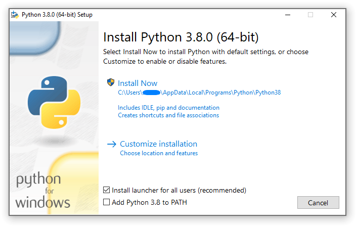

# 安装和使用 python

## windows

去 [python官方下载](https://www.python.org/downloads/) 这里下载 windows 安装程序。



建议为全部用户安装（install launcher for all users），并且选择自定义安装（customise installation）。<br>

建议选择添加 python 到系统环境变量 PATH 中。（add python 3.x to PATH）。

### 删除 MAX_PATH 限制

历史上 Windows 的路径长度限制为260个字符。这意味着长于此的路径将无法解决并导致错误。<br>

在最新版本的 Windows 中，此限制可被扩展到大约 32,000 个字符。 但需要让管理员激活“启用 Win32 长路径”组策略，或在注册表键 `HKEY_LOCAL_MACHINE\SYSTEM\CurrentControlSet\Control\FileSystem` 中设置 `LongPathsEnabled` 为` 1`。<br>

* 按下组合键 `win + R` 打开运行窗口，输入字符 `gpedit.msc`，确定后打开本地组策略编辑器窗口。依次点开 `计算机配置>管理模板>系统>文件系统`，找到`启用win32长路径`并双击打开。选择`启用`选项，然后单击`确定`，退出，重启电脑。

* 按下组合键 `win + R` 打开运行窗口，输入字符 `regedit`，确定后打开注册表编辑器。找到`HKEY_LOCAL_MACHINE\SYSTEM\CurrentControlSet\Control\FileSystem` 中设置 `LongPathsEnabled` 为` 1`

这允许 open() 函数，os 模块和大多数其他路径功能接受并返回长度超过 260 个字符的路径。<br>

更改上述选项后，无需进一步配置。

### 设置环境变量 多版本python同时存在

按下组合键 `win + R` 打开运行窗口，输入字符 `sysdm.cpl`，确定后打开系统属性窗口，在 `高级` 选项卡中点击 `环境变量` 打开环境变量窗口，在窗口中的系统变量列表中找到 `Path` 双击，在其中新建一个条目，输入python的安装路径，再新建一个条目，输入pip所在路径即可。<br>


如果想在系统中安装多个不同版本的 python ，直接安装，然后只需要在系统环境变量中修改不同版本的路径条目的上下顺序即可随时切换默认使用的python版本。

### python解释器模式 执行python脚本

打开 windows 的终端，输入 `python` 按下回车，这样系统就会从系统环境变量中的路径中寻找默认的python程序，然后进入python的解释器模式。


输入以下命令也可以进入 python 解释器模式：

```python
py # 进入默认版本 python 解释器模式 
py -2 # 进入 python 2.x 最新版本的解释器模式
py -2.7 # 进入指定的 python 版本的解释器模式
```

新建一个 `hello.py` 文件，内容如下：

```python
#! python2

import sys
sys.stdout.write("hello from Python %s\n" % (sys.version,))
```

在 `hello.py` 文件所在目录下执行命令：

```python

py hello.py
# hello from Python 2.7.18 (v2.7.18:8d21aa21f2, Apr 20 2020, 13:25:05) [MSC v.1500 64 bit (AMD64)]
```

可以看到返回的 python 版本是 2.7.18。<br>

如果我们将 `hello.py` 文件的第一行修改一下：

```python
#! python3
```

看下运行结果

```python

py hello.py
# hello from Python 3.9.1 (tags/v3.9.1:1e5d33e, Dec  7 2020, 17:08:21) [MSC v.1927 64 bit (AMD64)]
```

返回的 python 版本是 3.9.1。

### Shebang Lines

也被叫做 `Hashbang Line`，只要是一个由 `#` 井号和 `!` 叹号开头，并构成的字符序列 `#! xx/xx/x`，就叫做 `Shebang Line`。在开头字符之后，可以有一个或数个空白字符。这个字符串，通常只出现在 Script 文件的第一行。<br>

这个术语，来自于 `Unix` 操作系统。作用是在程序运行的时候，让程序载入器将 `#!` 后面的内容，作为解释器指令，并调用该指令。关于名字 `Shebang`，据说是来源于 `Sharp` 和 `bang` 两个单词的合并；`Sharp` 代表乐谱中的升号，这个符号和井号长得一样；而 `bang` 这个词，则代表砰的一声，之所以用它来表示 `!`，则是出自于漫画，因为漫画中，巨大声响后面都有个`!`号。<br>

在 Python 中，使用 Shebang Line 有下面两个原因：

1. 系统中很多不同版本的 Python，而这个程序的运行要，指定其中一个特定版本

2. 系统中有很多 Python 的虚拟环境，这个程序的运行要，指定特定的虚拟环境

为了允许 Python 脚本中的 shebang 行在 Unix 和 Windows 之间移植，该启动器支持许多“虚拟”命令来指定要使用的解释器。支持的虚拟命令是：

* /usr/bin/env python
* /usr/bin/python
* /usr/local/bin/python
* python

这些命令都可以显式指定版本:

```python
#! /usr/bin/python2
#! /usr/bin/python2.7
#! /usr/bin/python3
#! /usr/bin/python3.9
```

## 类unix系统（使用miniconda管理python环境）

各种 Linux 发行版系统还有 Mac 系统都属于类 Unix 系统，这些系统都依赖了 python，也就是说它们自带了 python 环境，并且系统自带的 python 环境不能随意卸载更改，因为系统组件依赖了固定版本的 python，如果删除或者更改，系统就会出现异常。<br>

那么怎么安装指定版本的 python 呢？答案是使用 conda。Conda 是一个是为 Python 而设的开源包管理系统和环境管理系统，用于安装 Python 及相应的包（库），其实就是 Python 环境安装、运行、管理平台。而 miniconda 是 conda 的最小完整功能版本，我们只需要去[ conda 官网下载](https://docs.conda.io/en/latest/miniconda.html) miniconda 安装后就可以管理 python 环境了。<br>

建议也在 windows 系统上安装 miniconda 来管理多个不同版本的 python 环境。而不要使用上文的方法。<br>

```python
conda info -e # 查看所有已创建的环境

conda create -n xxx python=2.7.18 # 创建名字为 xxx python版本为 2.7.18 的新环境

conda activate xxx # 使用名字为 xxx 的环境

conda deactivate # 取消使用当前环境

conda remove -n xxx --all # 移除名字为 xxx 的环境

conda list # 列出当前使用环境安装的所有包

conda list -n xxx # 列出名字为 xxx 的环境下安装的所有包

conda install xxx=2.22.0 # 安装名为 xxx 的包指定版本为 2.22.0 到当前环境下

conda remove xxx # 移除当前环境下名为 xxx 的包 
```